# Create Order Saga
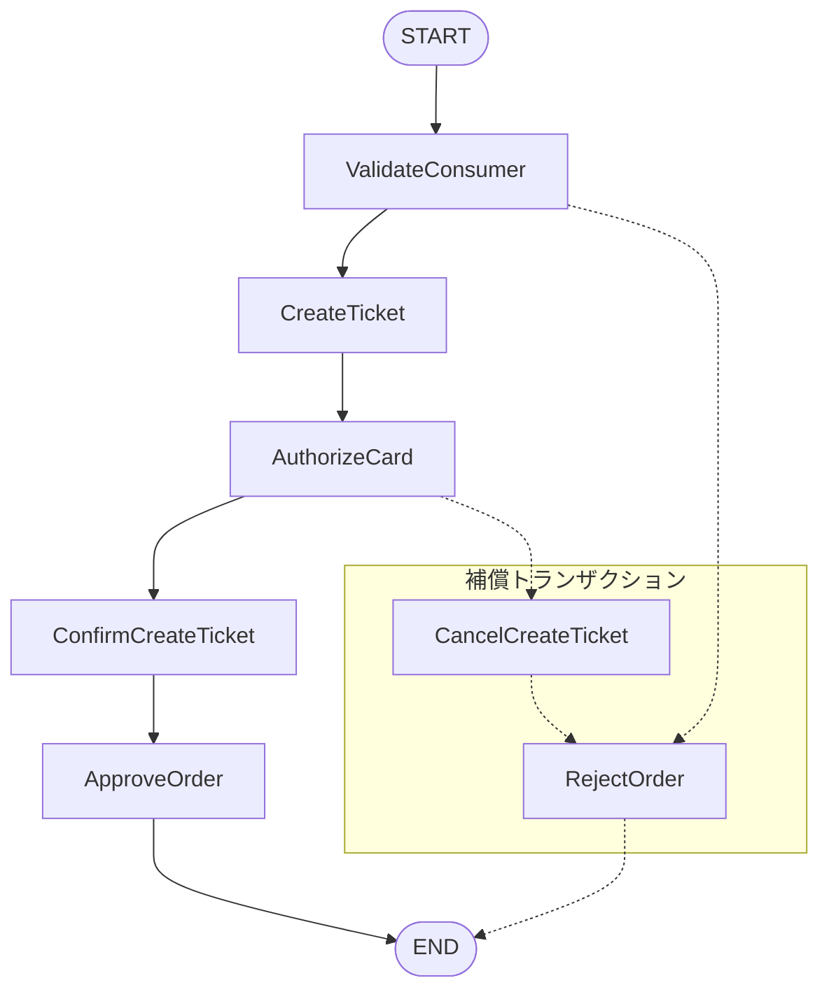
```mermaid
flowchart TB
    Start([START]) --> ValidateConsumer 
    ValidateConsumer --> CreateTicket
    CreateTicket --> AuthorizeCard
    AuthorizeCard --> ConfirmCreateTicket
    ConfirmCreateTicket --> ApproveOrder
    ApproveOrder  --> End([END])
    
    AuthorizeCard -.-> CancelCreateTicket

    ValidateConsumer -.-> RejectOrder

    subgraph sub1 [補償トランザクション]
    CancelCreateTicket -.-> RejectOrder
    end

    RejectOrder  -.-> End([END])
  
```

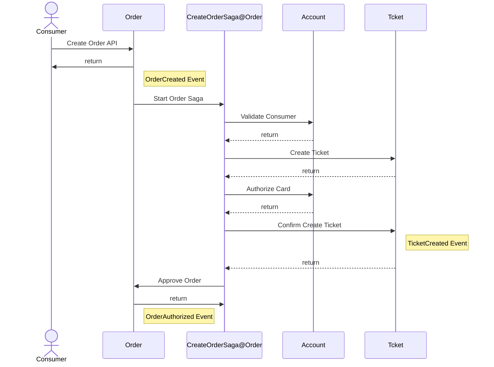
```mermaid
sequenceDiagram

    actor Consumer
    
    Consumer ->> Order: Create Order API
    Order ->> Consumer: return
    Note right of Order: OrderCreated Event
    
    Order ->> CreateOrderSaga@Order: Start Order Saga

    CreateOrderSaga@Order ->> Account: Validate Consumer
    Account -->> CreateOrderSaga@Order: return    

    CreateOrderSaga@Order ->> Tcket: Create Ticket
    Tcket -->> CreateOrderSaga@Order: return

    CreateOrderSaga@Order ->> Account: Authorize Card
    Account -->> CreateOrderSaga@Order: return    

    CreateOrderSaga@Order ->> Tcket: Confirm Create Ticket
    Note right of Tcket: TicketCreated Event
    Tcket -->> CreateOrderSaga@Order: return

    CreateOrderSaga@Order ->> Order: Approve Order
    Order ->> CreateOrderSaga@Order: return
    Note right of Order: OrderAuthorized Event

```
# 補償トランザクション
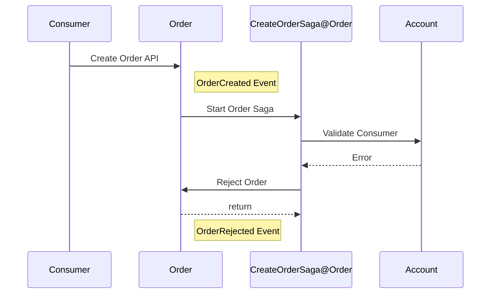
```mermaid
sequenceDiagram
    
    Consumer ->> Order: Create Order API
    Note right of Order: OrderCreated Event
    Order ->> CreateOrderSaga@Order: Start Order Saga

    CreateOrderSaga@Order ->> Account: Validate Consumer
    Account -->> CreateOrderSaga@Order: Error    

    CreateOrderSaga@Order ->> Order: Reject Order
    Order -->> CreateOrderSaga@Order: return
    Note right of Order: OrderRejected Event

```
# 補償トランザクション
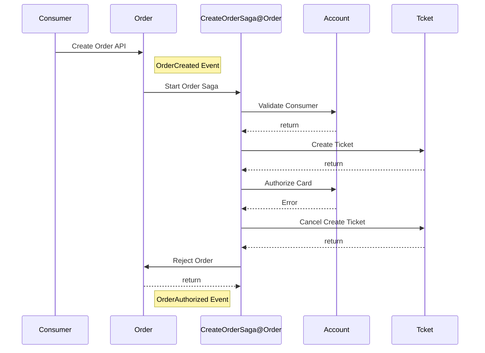
```mermaid
sequenceDiagram

    Consumer ->> Order: Create Order API
    Note right of Order: OrderCreated Event
    Order ->> CreateOrderSaga@Order: Start Order Saga

    CreateOrderSaga@Order ->> Account: Validate Consumer
    Account -->> CreateOrderSaga@Order: return    

    CreateOrderSaga@Order ->> Tcket: Create Ticket
    Tcket -->> CreateOrderSaga@Order: return

    CreateOrderSaga@Order ->> Account: Authorize Card
    Account -->> CreateOrderSaga@Order: Error    
    
    CreateOrderSaga@Order ->> Tcket: Cancel Create Ticket
    Tcket -->> CreateOrderSaga@Order: return

    CreateOrderSaga@Order ->> Order: Reject Order
    Order -->> CreateOrderSaga@Order: return
    Note right of Order: OrderAuthorized Event

```


# Reverse Order Saga
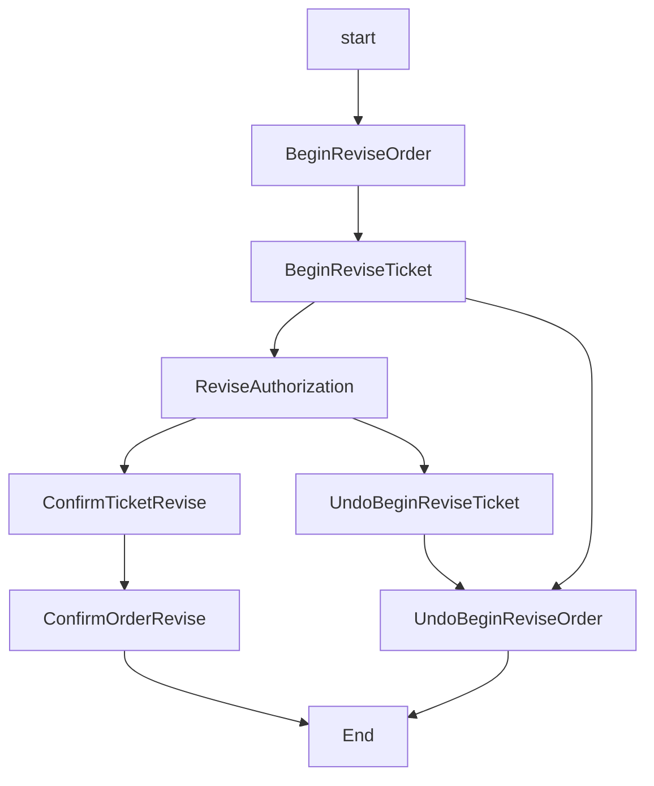
```mermaid
flowchart TB
   start -->
   BeginReviseOrder -->
   BeginReviseTicket -->  
   ReviseAuthorization --> 
   ConfirmTicketRevise --> 
   ConfirmOrderRevise
   --> End
   BeginReviseTicket --> UndoBeginReviseOrder
   ReviseAuthorization --> UndoBeginReviseTicket
   --> UndoBeginReviseOrder
   --> End
```

# Revise Order REST API
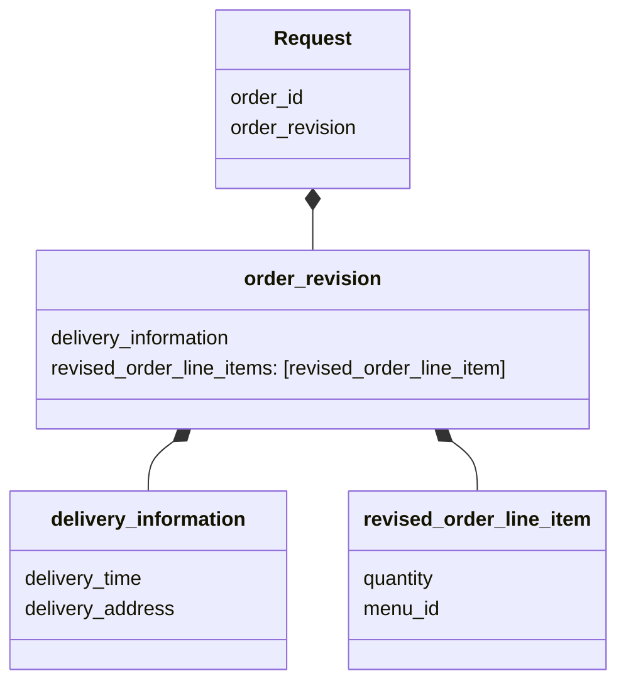
```mermaid
classDiagram
    
    Request *-- order_revision
    order_revision *-- delivery_information
    order_revision *-- revised_order_line_item
    
    class Request{
        order_id
        order_revision
    }
    class order_revision{
        delivery_information
        revised_order_line_items: [revised_order_line_item]
    }
    class delivery_information{
        delivery_time
        delivery_address
    }
    class revised_order_line_item{
        quantity
        menu_id
    }
```

# Revise Order SAGA - INPUT
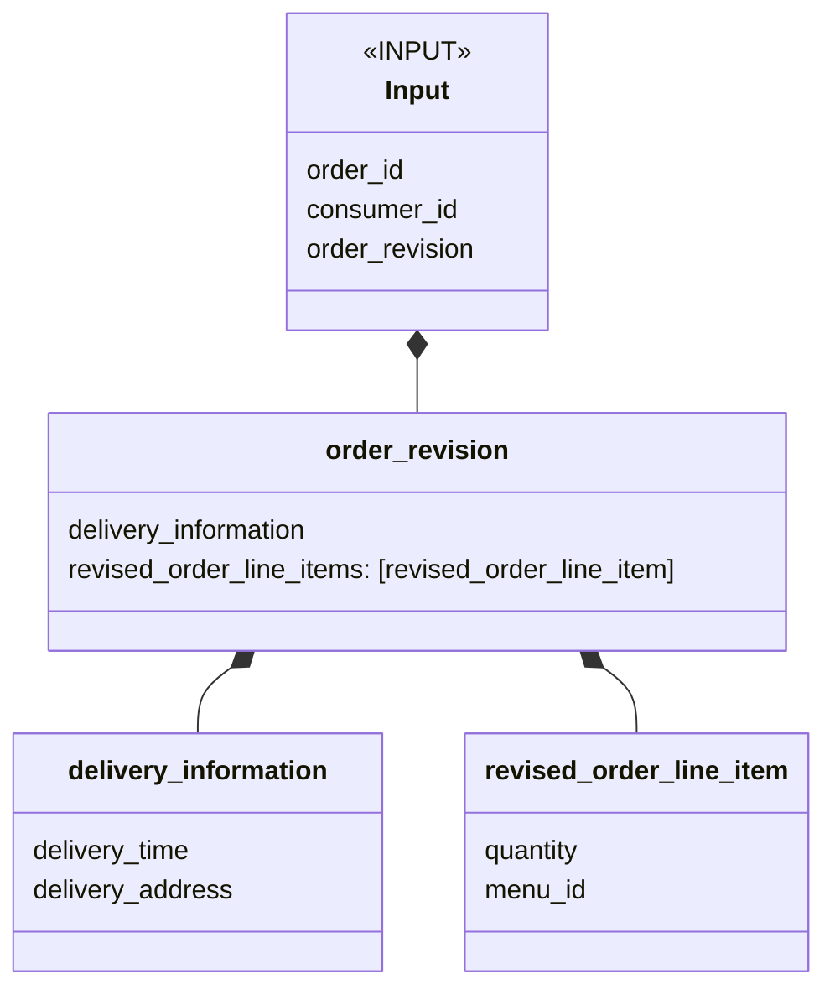
```mermaid
classDiagram
    
    Input *-- order_revision
    order_revision *-- delivery_information
    order_revision *-- revised_order_line_item
    
    class Input{
        <<INPUT>>
        order_id
        consumer_id
        order_revision
    }
    class order_revision{
        delivery_information
        revised_order_line_items: [revised_order_line_item]
    }
    class delivery_information{
        delivery_time
        delivery_address
    }
    class revised_order_line_item{
        quantity
        menu_id
    }
```

## BeginReviseOrder
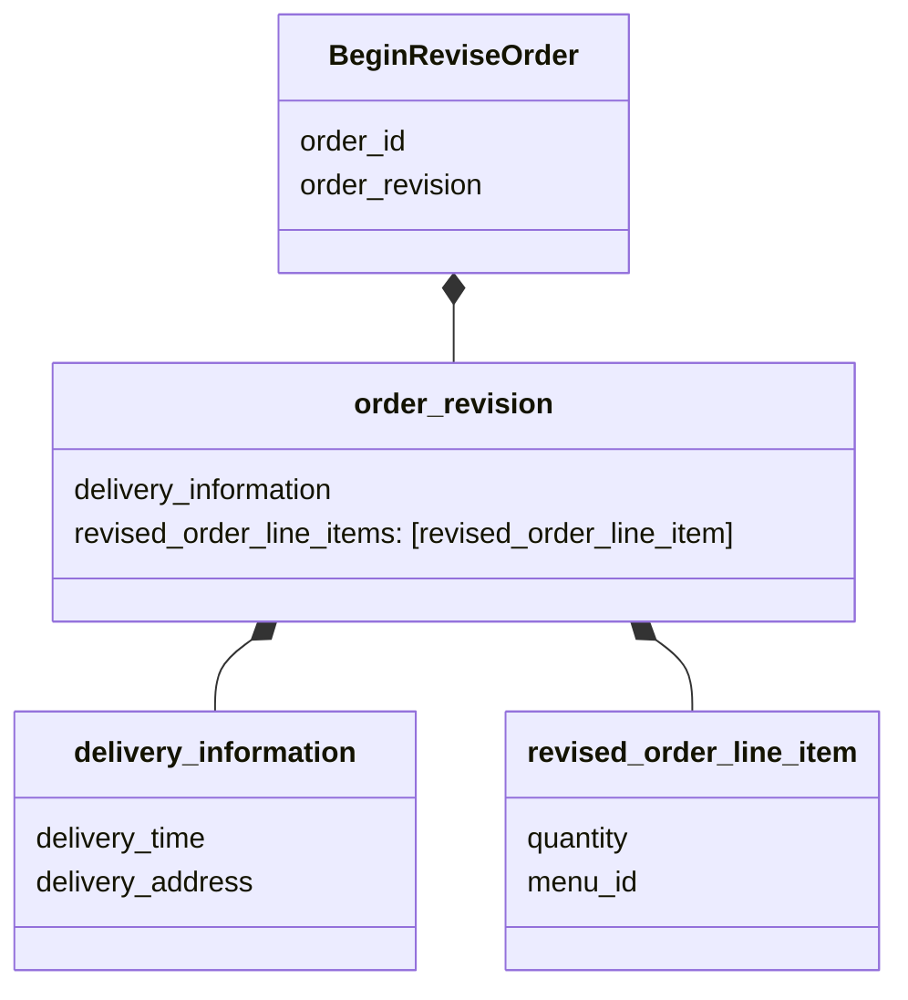
```mermaid
classDiagram
   
    BeginReviseOrder *-- order_revision
    order_revision *-- delivery_information
    order_revision *-- revised_order_line_item

   
   class  BeginReviseOrder {
        order_id
        order_revision
   }
    class order_revision{
        delivery_information
        revised_order_line_items: [revised_order_line_item]
    }
    class delivery_information{
        delivery_time
        delivery_address
    }
    class revised_order_line_item{
        quantity
        menu_id
    }
```

## BeginReviseTicket
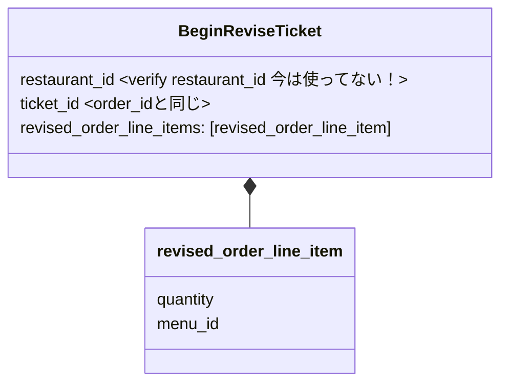
```mermaid
classDiagram
   
    BeginReviseTicket *-- revised_order_line_item

    class  BeginReviseTicket {
        restaurant_id ~verify restaurant_id 今は使ってない！~
        ticket_id     ~order_idと同じ~
        revised_order_line_items: [revised_order_line_item]
    }
    class revised_order_line_item{
        quantity
        menu_id
    }
```

## ReviseAuthorization
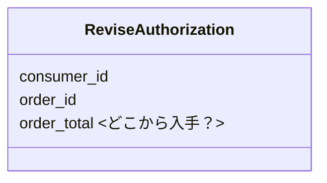
```mermaid
classDiagram
   
    class  ReviseAuthorization {
        consumer_id
        order_id
        order_total  ~どこから入手？~
    }
```

## ConfirmTicketRevise
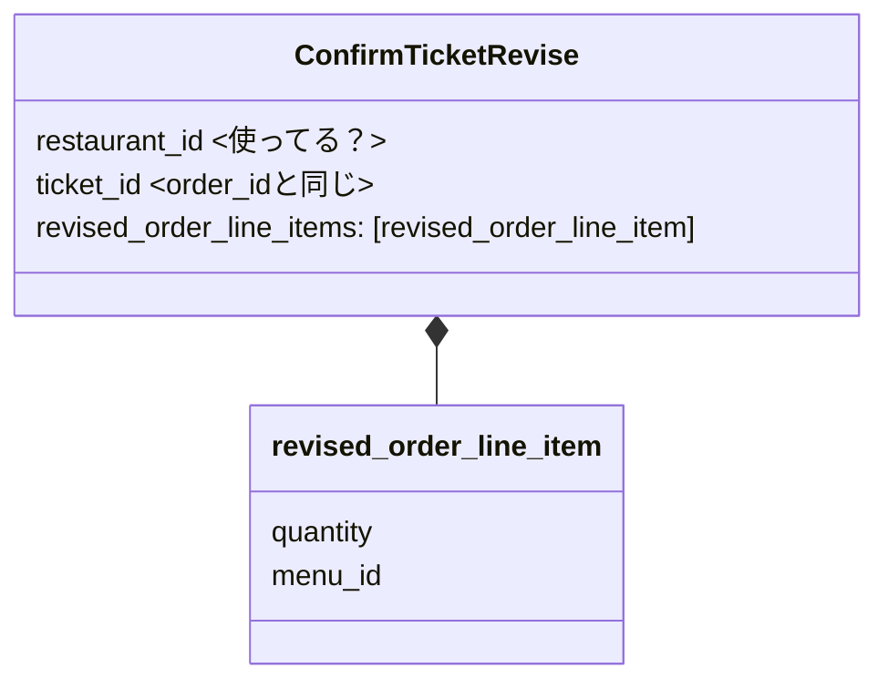
```mermaid
classDiagram
   
    ConfirmTicketRevise *-- revised_order_line_item

    class  ConfirmTicketRevise {
        restaurant_id ~使ってる？~
        ticket_id     ~order_idと同じ~
        revised_order_line_items: [revised_order_line_item]
    }
    class revised_order_line_item{
        quantity
        menu_id
    }
```

## ConfirmOrderRevise
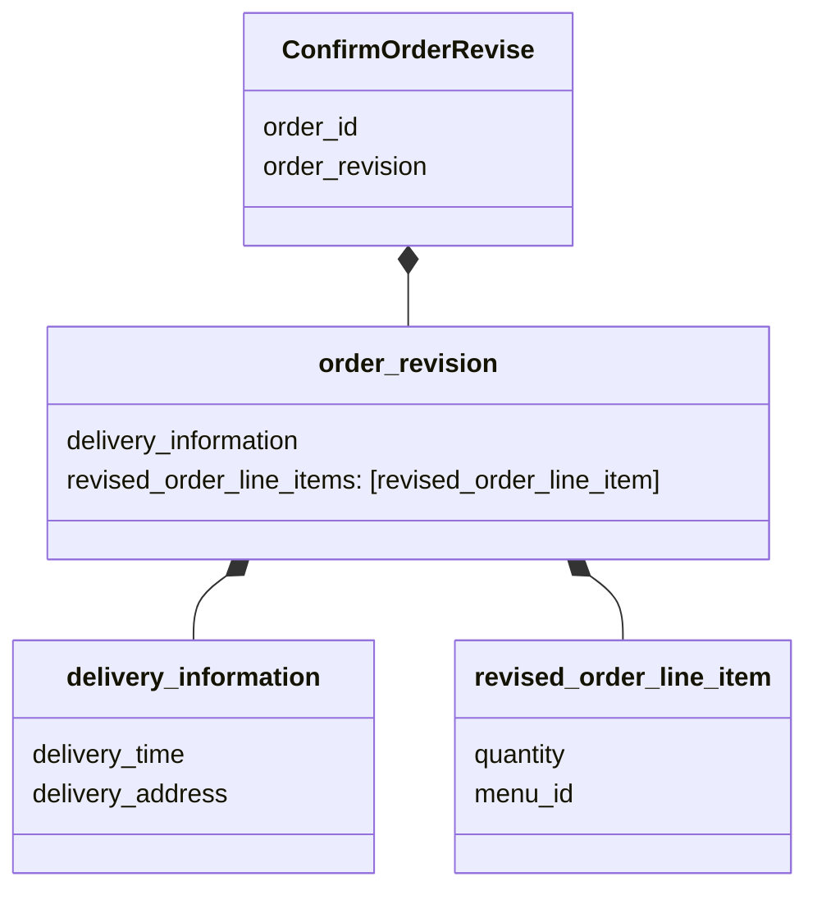
```mermaid
classDiagram
   
    ConfirmOrderRevise *-- order_revision
    order_revision *-- delivery_information
    order_revision *-- revised_order_line_item

    class  ConfirmOrderRevise {
        order_id
        order_revision
    }
    class order_revision{
        delivery_information
        revised_order_line_items: [revised_order_line_item]
    }
    class delivery_information{
        delivery_time
        delivery_address
    }
    class revised_order_line_item{
        quantity
        menu_id
    }
```

## UndoBeginReviseOrder - 補償トランザクション
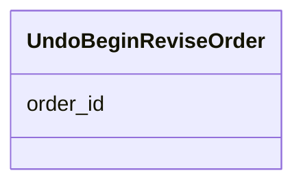
```mermaid
classDiagram
   
    class  UndoBeginReviseOrder {
        order_id
    }
```

## UndoBeginReviseTicket - 補償トランザクション
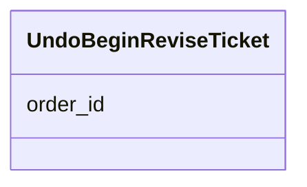
```mermaid
classDiagram
   
    class  UndoBeginReviseTicket {
        order_id
    }
```

-----

# Cancel Order Saga
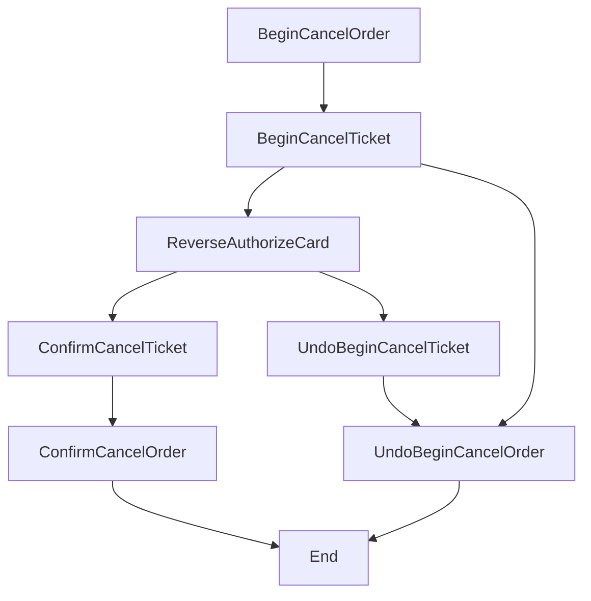
```mermaid
flowchart TB
   BeginCancelOrder --> BeginCancelTicket
   BeginCancelTicket --> ReverseAuthorizeCard 
   ReverseAuthorizeCard --> ConfirmCancelTicket
   ConfirmCancelTicket --> ConfirmCancelOrder
  
   ConfirmCancelOrder --> End
   BeginCancelTicket --> UndoBeginCancelOrder
   UndoBeginCancelOrder --> End
   ReverseAuthorizeCard --> UndoBeginCancelTicket
   UndoBeginCancelTicket --> UndoBeginCancelOrder
```

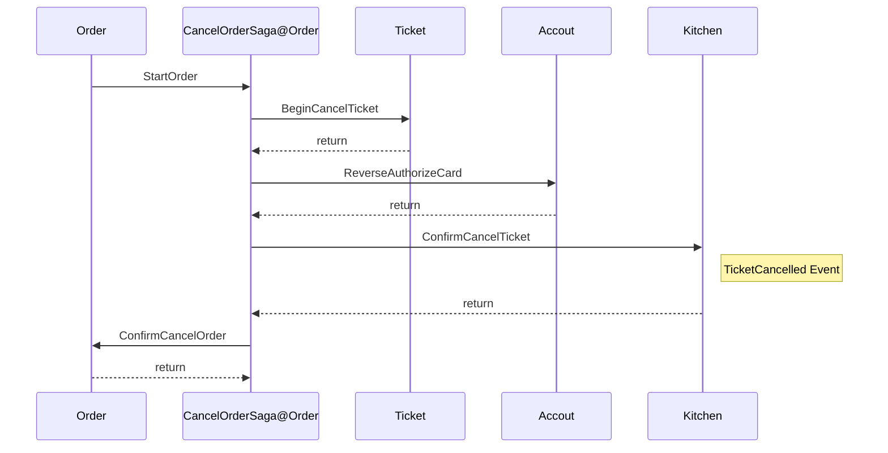
```mermaid
sequenceDiagram
    Order ->> CancelOrderSaga@Order: StartOrder
    CancelOrderSaga@Order ->> Ticket: BeginCancelTicket
    Ticket -->> CancelOrderSaga@Order: return
    
    CancelOrderSaga@Order ->> Accout: ReverseAuthorizeCard
    Accout -->> CancelOrderSaga@Order: return
    
    CancelOrderSaga@Order ->> Kitchen: ConfirmCancelTicket
    Note right of Kitchen: TicketCancelled Event
    Kitchen -->> CancelOrderSaga@Order: return
    
    CancelOrderSaga@Order ->> Order: ConfirmCancelOrder
    Order -->> CancelOrderSaga@Order: return    
```
# 補償トランザクション
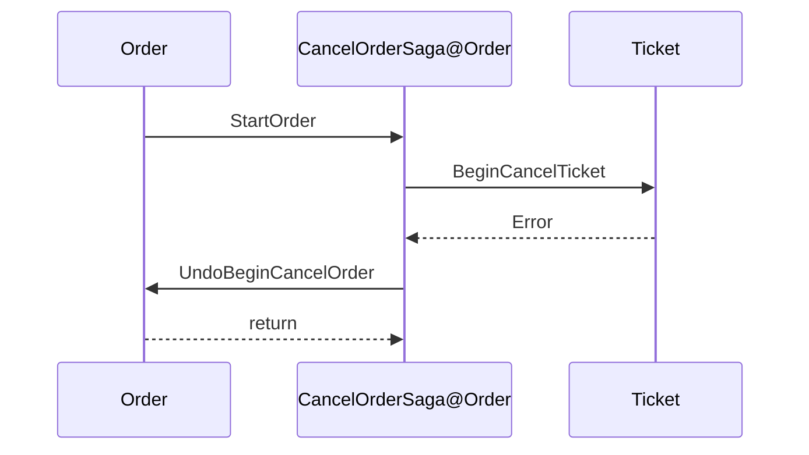
```mermaid
sequenceDiagram
    Order ->> CancelOrderSaga@Order: StartOrder
    CancelOrderSaga@Order ->> Ticket: BeginCancelTicket
    Ticket -->> CancelOrderSaga@Order: Error
            
    CancelOrderSaga@Order ->> Order: UndoBeginCancelOrder
    Order -->> CancelOrderSaga@Order: return    
```
# 補償トランザクション
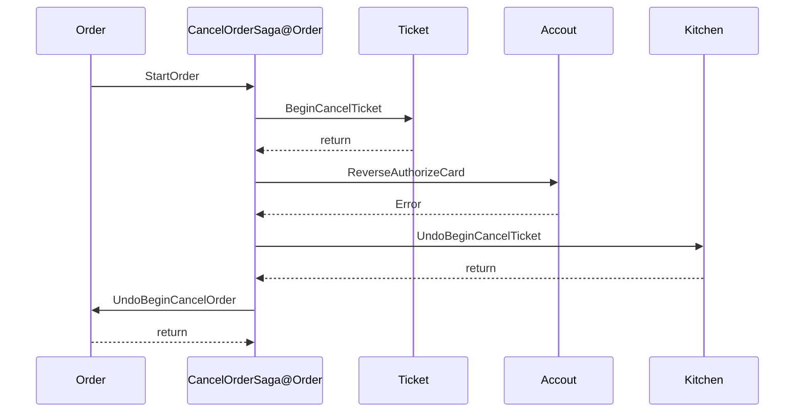
```mermaid
sequenceDiagram
    Order ->> CancelOrderSaga@Order: StartOrder
    CancelOrderSaga@Order ->> Ticket: BeginCancelTicket
    Ticket -->> CancelOrderSaga@Order: return
    
    CancelOrderSaga@Order ->> Accout: ReverseAuthorizeCard
    Accout -->> CancelOrderSaga@Order: Error
    
    CancelOrderSaga@Order ->> Kitchen: UndoBeginCancelTicket
    Kitchen -->> CancelOrderSaga@Order: return
    
    CancelOrderSaga@Order ->> Order: UndoBeginCancelOrder
    Order -->> CancelOrderSaga@Order: return    
```


# Restaurant Created Event from EventBridge

### Order Service lambda_handler.event
```json
{
    "version": "0",
    "id": "a036599d-fd7c-301f-9c6e-34dfc947e39e",
    "detail-type": "RestaurantCreated",
    "source": "com.restaurant.created",
    "account": "338456725408",
    "time": "2022-12-01T04:05:59Z",
    "region": "ap-northeast-1",
    "resources": [],
    "detail": {
        "event_id": "32ef7c373d3f461c88082729f89d1190",
        "restaurant_id": 11,
        "restaurant_address": {
            "zip": "94611",
            "city": "Oakland",
            "street1": "1 Main Street",
            "street2": "Unit 99",
            "state": "CA"
        },
        "SK": "CHANNEL#RestaurantCreated#EVENTID#32ef7c373d3f461c88082729f89d1190",
        "menu_items": [
            {
                "price": {
                    "currency": "JPY",
                    "value": 800
                },
                "menu_name": "Curry Rice",
                "menu_id": "000001"
            },
            {
                "price": {
                    "currency": "JPY",
                    "value": 1000
                },
                "menu_name": "Hamburger",
                "menu_id": "000002"
            },
            {
                "price": {
                    "currency": "JPY",
                    "value": 700
                },
                "menu_name": "Ramen",
                "menu_id": "000003"
            }
        ],
        "PK": "RESTAURANT#11",
        "restaurant_name": "skylark",
        "channel": "RestaurantCreated"
    }
}
```
### Order Service lambda_handler.context
```python
context = LambdaContext(
    [
        aws_request_id=1a0cab84-4573-4a74-8b50-bc885e3b9f84,
        log_group_name=/aws/lambda/order_service_function,
        log_stream_name=2022/12/01/[$LATEST]c813b9d8ce5f481188e1ebfcbfdc547e,
        function_name=order_service_function,
        memory_limit_in_mb=128,
        function_version=$LATEST,
        invoked_function_arn=arn:aws:lambda:ap-northeast-1:338456725408:function:order_service_function,
        client_context=None,
        identity=CognitoIdentity([cognito_identity_id=None, cognito_identity_pool_id=None])
    ]
)
```
