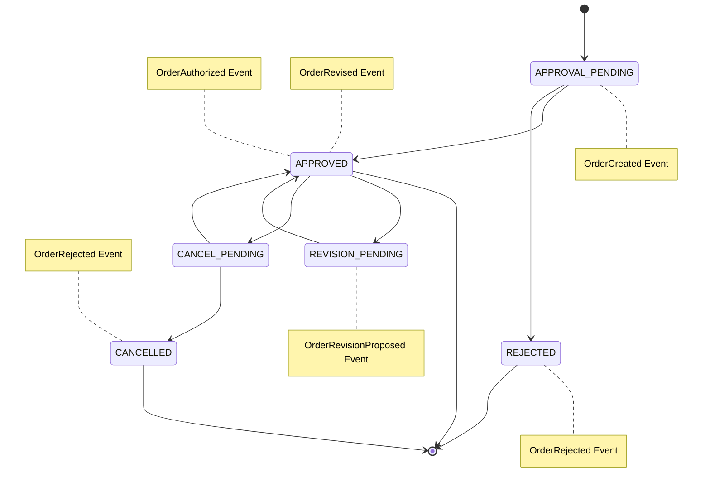
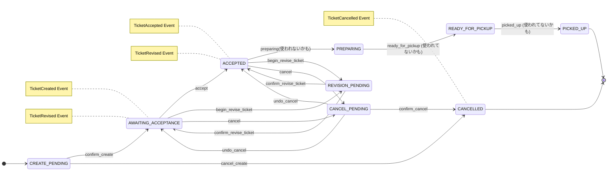
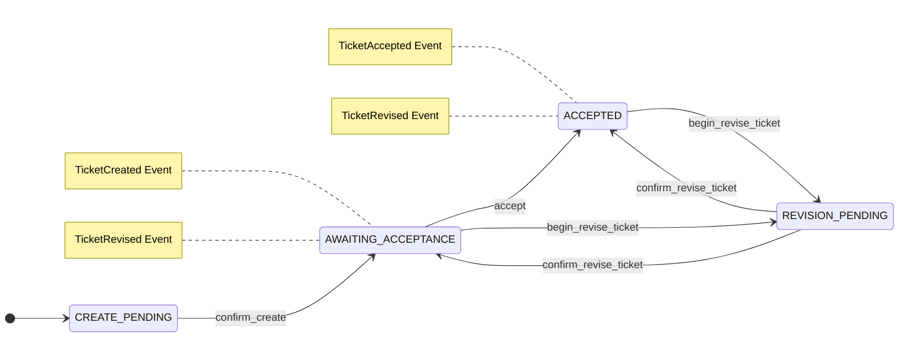
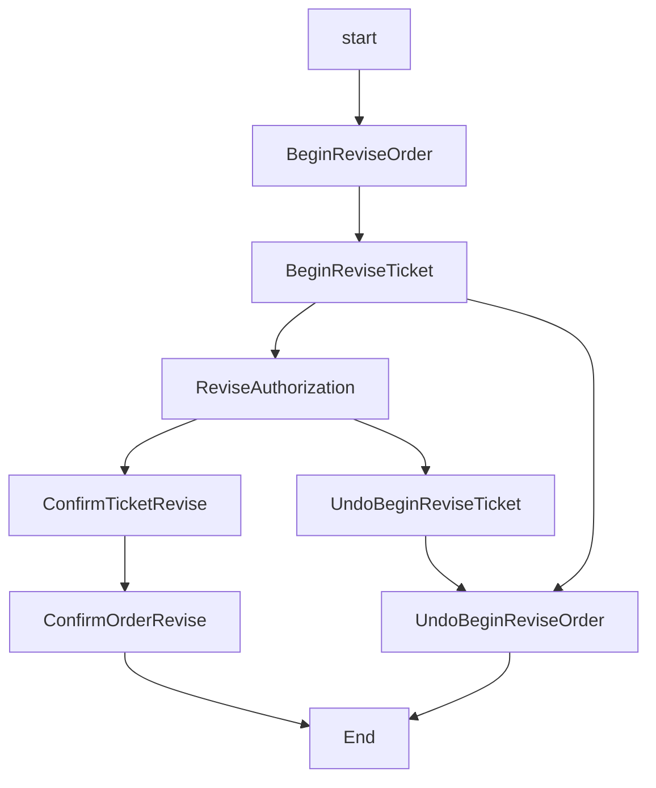

# Order State

```mermaid
stateDiagram
    [*] --> APPROVAL_PENDING
    note right of APPROVAL_PENDING : OrderCreated Event
    APPROVAL_PENDING --> APPROVED
    note left of APPROVED : OrderAuthorized Event
    note left of APPROVED : OrderRevised Event
    APPROVED --> [*]
    
    APPROVAL_PENDING --> REJECTED
    note right of REJECTED : OrderRejected Event
    REJECTED --> [*]

    APPROVED --> REVISION_PENDING
    note right of REVISION_PENDING : OrderRevisionProposed Event
    REVISION_PENDING --> APPROVED

    APPROVED --> CANCEL_PENDING
    
    CANCEL_PENDING --> CANCELLED
    note left of CANCELLED : OrderRejected Event
    CANCEL_PENDING --> APPROVED

    CANCELLED --> [*]
```

# Ticket State - 全体

```mermaid
stateDiagram-v2
    direction LR
    [*] --> CREATE_PENDING
    CREATE_PENDING --> AWAITING_ACCEPTANCE: confirm_create
    note left of AWAITING_ACCEPTANCE : TicketCreated Event
    note left of AWAITING_ACCEPTANCE : TicketRevised Event

    AWAITING_ACCEPTANCE --> ACCEPTED: accept
    note left of ACCEPTED : TicketAccepted Event
    note left of ACCEPTED : TicketRevised Event

    ACCEPTED --> PREPARING: preparing(使われないかも)
    PREPARING --> READY_FOR_PICKUP: ready_for_pickup (使われてないかも)
    READY_FOR_PICKUP --> PICKED_UP: picked_up (使われてないかも)
    PICKED_UP --> [*]
    
    AWAITING_ACCEPTANCE --> REVISION_PENDING: begin_revise_ticket
    ACCEPTED --> REVISION_PENDING: begin_revise_ticket

    REVISION_PENDING --> AWAITING_ACCEPTANCE: confirm_revise_ticket
    REVISION_PENDING --> ACCEPTED: confirm_revise_ticket
    
    AWAITING_ACCEPTANCE --> CANCEL_PENDING: cancel
    ACCEPTED --> CANCEL_PENDING: cancel
    
    
    CANCEL_PENDING --> AWAITING_ACCEPTANCE: undo_cancel         
    CANCEL_PENDING --> ACCEPTED: undo_cancel         
    CREATE_PENDING --> CANCELLED: cancel_create    
    CANCEL_PENDING --> CANCELLED: confirm_cancel
    note left of CANCELLED : TicketCancelled Event

    CANCELLED --> [*]
```

# Ticket State - Revise Order関連

```mermaid
stateDiagram-v2
    direction LR
    [*] --> CREATE_PENDING

    CREATE_PENDING --> AWAITING_ACCEPTANCE: confirm_create
    note left of AWAITING_ACCEPTANCE : TicketCreated Event
    note left of AWAITING_ACCEPTANCE : TicketRevised Event

    AWAITING_ACCEPTANCE --> ACCEPTED: accept
    note left of ACCEPTED : TicketAccepted Event
    note left of ACCEPTED : TicketRevised Event

    ACCEPTED --> REVISION_PENDING: begin_revise_ticket

    AWAITING_ACCEPTANCE --> REVISION_PENDING: begin_revise_ticket

    REVISION_PENDING --> AWAITING_ACCEPTANCE: confirm_revise_ticket

    REVISION_PENDING --> ACCEPTED: confirm_revise_ticket
```

# Reverse Order Saga

```mermaid
flowchart TB
   start -->
   BeginReviseOrder -->
   BeginReviseTicket -->  
   ReviseAuthorization --> 
   ConfirmTicketRevise --> 
   ConfirmOrderRevise
   --> End
   BeginReviseTicket --> UndoBeginReviseOrder
   ReviseAuthorization --> UndoBeginReviseTicket
   --> UndoBeginReviseOrder
   --> End
```

