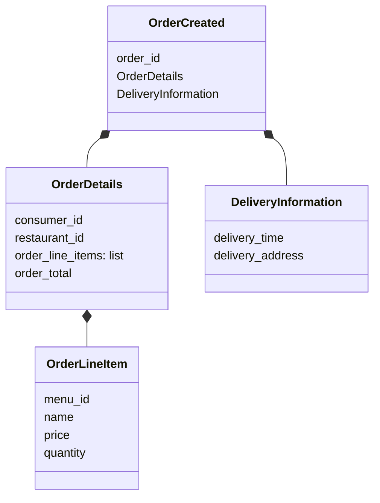
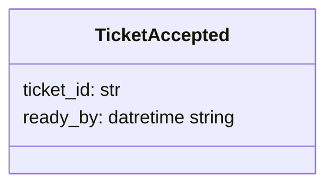

### Events Sequence
```mermaid
sequenceDiagram
    actor Consumer
    actor KitchenUser
    actor Courier
    actor CancelOrderSaga@Order

    Note right of Restaurant: RestaurantCreated
    Restaurant --) Order: RestaurantCreated    
    Restaurant --) Kitchen: RestaurantCreated
    Restaurant --) Delivery: RestaurantCreated
    
    alt
        Courier ->> Delivery: CourierAvailable
        Delivery ->> Courier@Delivery: CourierAvailable
    end

    alt    
        Consumer ->> Order: CreateOrder
        Note right of Order: OrderCreated
        Order --) Delivery: OrderCreated
    end
    
    alt
        KitchenUser ->> Kitchen: acceptTicket
        Note right of Kitchen: TicketAccepted
        Kitchen --) Delivery: TicketAccepted
    
        activate Delivery
        Delivery ->> Courier@Delivery: add_action
        Delivery ->> Delivery: schedule_delivery
        deactivate Delivery
    end
    
    alt
        CancelOrderSaga@Order ->> Kitchen: Cancel Ticket
        Note right of Kitchen: TicketCancelled
        Kitchen --) Delivery: TicketCancelled
        activate Delivery
        Delivery ->> Courier@Delivery: cancel delivery
        Delivery ->> Delivery: cancel_delivery
        deactivate Delivery
    end
    
```

### OrderCreated Event


### TicketAccepted Event

