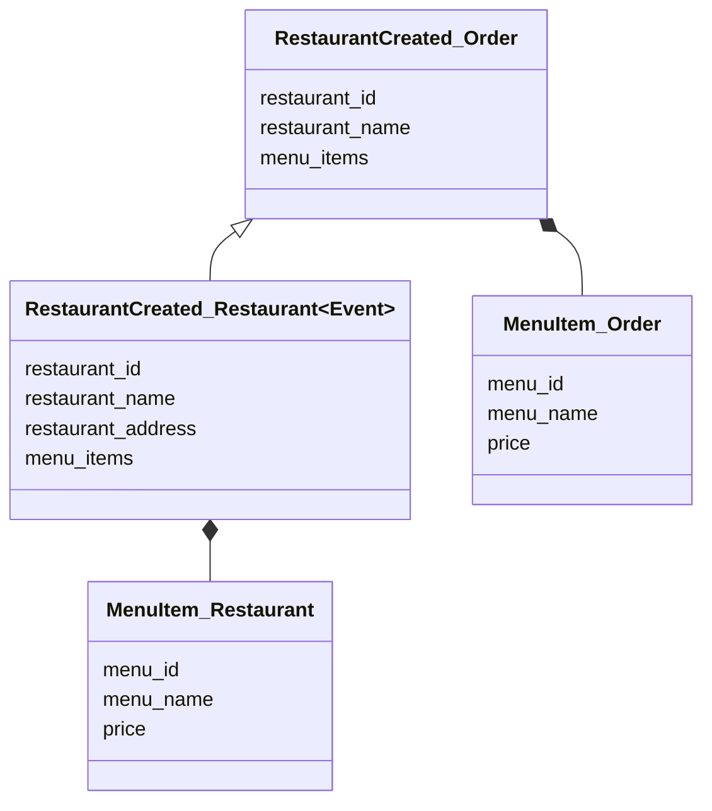
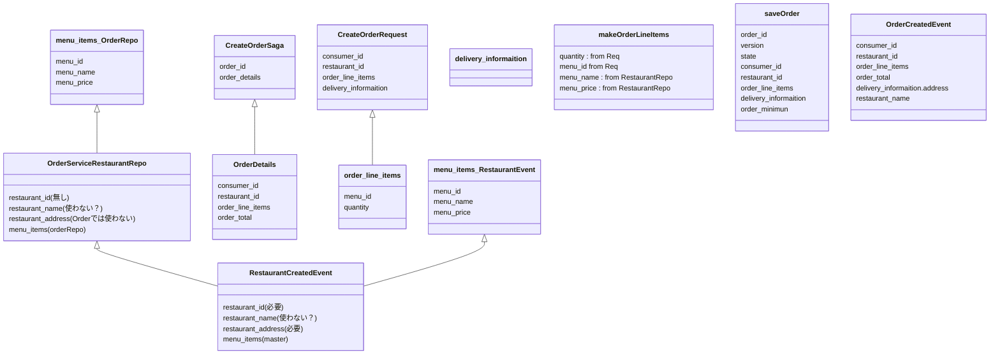

```
this.sagaDefinition =
         step()
          .withCompensation(orderService.reject, CreateOrderSagaState::makeRejectOrderCommand)
        .step()
          .invokeParticipant(consumerService.validateOrder, CreateOrderSagaState::makeValidateOrderByConsumerCommand)  // Todo: ①顧客のチェック (顧客サービス)
        .step()
          .invokeParticipant(kitchenService.create, CreateOrderSagaState::makeCreateTicketCommand)  // Todo: ② チケットの作成 (キッチンサービス)
          .onReply(CreateTicketReply.class, CreateOrderSagaState::handleCreateTicketReply)
          .withCompensation(kitchenService.cancel, CreateOrderSagaState::makeCancelCreateTicketCommand)
        .step()
            .invokeParticipant(accountingService.authorize, CreateOrderSagaState::makeAuthorizeCommand)  // Todo: ③カード承認 (会計サービス)
        .step()
          .invokeParticipant(kitchenService.confirmCreate, CreateOrderSagaState::makeConfirmCreateTicketCommand)  // Todo: ④ キッチンサービス承認
        .step()
          .invokeParticipant(orderService.approve, CreateOrderSagaState::makeApproveOrderCommand)  // Todo: ⑤ オーダ承認 (オーダサービス)
        .build();

```

```
sagaDefinition = step()
        .invokeParticipant(this::beginReviseOrder)
        .onReply(BeginReviseOrderReply.class, this::handleBeginReviseOrderReply)
        .withCompensation(this::undoBeginReviseOrder)
        .step()
        .invokeParticipant(this::beginReviseTicket)
        .withCompensation(this::undoBeginReviseTicket)
        .step()
        .invokeParticipant(this::reviseAuthorization)
        .step()
        .invokeParticipant(this::confirmTicketRevision)
        .step()
        .invokeParticipant(this::confirmOrderRevision)
        .build();
```
```
    sagaDefinition = step()
            .invokeParticipant(this::beginCancel)
            .withCompensation(this::undoBeginCancel)
            .step()
            .invokeParticipant(this::beginCancelTicket)
            .withCompensation(this::undoBeginCancelTicket)
            .step()
            .invokeParticipant(this::reverseAuthorization)
            .step()
            .invokeParticipant(this::confirmTicketCancel)
            .step()
            .invokeParticipant(this::confirmOrderCancel)
            .build();
```

```
REST API

@RequestMapping(path = "/orders")
@RequestMapping(method = RequestMethod.POST)
create(@RequestBody CreateOrderRequest request)
    Order order = orderService.createOrder()


@RequestMapping(path = "/{orderId}", method = RequestMethod.GET)
getOrder(@PathVariable long orderId)

@RequestMapping(path = "/{orderId}/cancel", method = RequestMethod.POST)
public ResponseEntity<GetOrderResponse> cancel(@PathVariable long orderId) {
    Order order = orderService.cancel(orderId);


@RequestMapping(path = "/{orderId}/revise", method = RequestMethod.POST)
public ResponseEntity<GetOrderResponse> revise(@PathVariable long orderId, @RequestBody ReviseOrderRequest request) {
    Order order = orderService.reviseOrder(orderId, new OrderRevision(Optional.empty(), request.getRevisedOrderLineItems()));

```


```
public class OrderEventConsumer {

  private OrderService orderService;

  public OrderEventConsumer(OrderService orderService) {
    this.orderService = orderService;
  }

  public DomainEventHandlers domainEventHandlers() {
    return DomainEventHandlersBuilder
            .forAggregateType("net.chrisrichardson.ftgo.restaurantservice.domain.Restaurant")
            .onEvent(RestaurantCreated.class, this::createMenu)
            .onEvent(RestaurantMenuRevised.class, this::reviseMenu)
            .build();
  }

  private void createMenu(DomainEventEnvelope<RestaurantCreated> de) {
    String restaurantIds = de.getAggregateId();
    long id = Long.parseLong(restaurantIds);
    orderService.createMenu(id, de.getEvent().getName(), RestaurantEventMapper.toMenuItems(de.getEvent().getMenu().getMenuItems()));
  }

  public void reviseMenu(DomainEventEnvelope<RestaurantMenuRevised> de) {
    String restaurantIds = de.getAggregateId();
    long id = Long.parseLong(restaurantIds);
    orderService.reviseMenu(id, RestaurantEventMapper.toMenuItems(de.getEvent().getMenu().getMenuItems()));
  }

}
```


```
Service Layer

  public void createMenu(long id, String name, List<MenuItem> menuItems) {
    Restaurant restaurant = new Restaurant(id, name, menuItems);
    restaurantRepository.save(restaurant);
  }

  public void reviseMenu(long id, List<MenuItem> menuItems) {
    restaurantRepository.findById(id).map(restaurant -> {
      List<OrderDomainEvent> events = restaurant.reviseMenu(menuItems);
      return restaurant;
    }).orElseThrow(RuntimeException::new);
  }
```